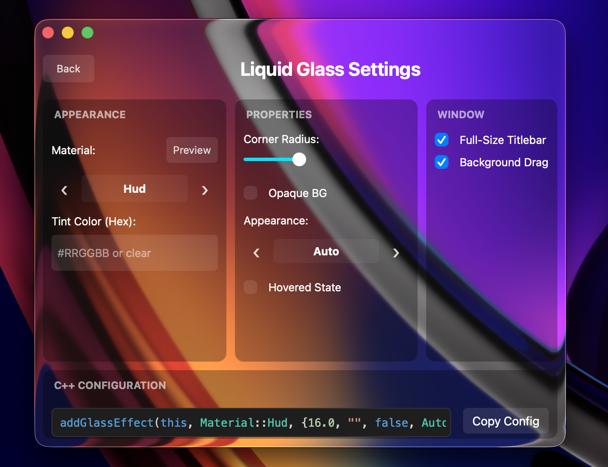

# qt-liquid-glass

<div align="center">
  
  
  <br><br>

  **Native Liquid Glass effect for macOS Qt6 applications**
  
   Instantiates AppKit’s `NSGlassEffectView` directly through Objective-C runtime, with private variant selectors for extended styles.


</div>

---

## 🧩 Features

-  **Native Glass Effects** — Real `NSGlassEffectView` integration with private extended variants and `NSVisualEffectView` fallback for older macOS.
-  **Qt Integration** — Works seamlessly with `QWidget` and `QMainWindow`.
-  **15 Materials** — Sidebar, HUD, Popover, Frosted, ClearGlass, Chromatic, and more.
-  **Appearance Control** — Force light/dark mode or follow the system automatically.
-  **Interaction States** — Normal and hovered states for interactive glass surfaces.
-  **Standard and Frameless Windows** — Supports standard Qt windows and includes a best-effort native wrapping path for frameless windows (`Qt::FramelessWindowHint`).

## 🚀 Installation

### Option A: Embed (Recommended)
This is the simplest way to get started. Clone the repository into your project structure.

```bash
git clone https://github.com/fsalinas26/qt-liquid-glass.git
```

```cmake
# In your CMakeLists.txt
add_subdirectory(QtLiquidGlass)
target_link_libraries(YourApp PRIVATE QtLiquidGlass)
```

### Option B: System Install (`find_package`)
If you prefer to install the library system-wide or use it across multiple projects:

1.  **Build and Install:**
    ```bash
    git clone https://github.com/fsalinas26/qt-liquid-glass.git
    cd qt-liquid-glass && mkdir build && cd build
    cmake ..
    sudo cmake --install .
    ```

2.  **Use in your project:**
    ```cmake
    find_package(QtLiquidGlass 0.3.0 REQUIRED)
    target_link_libraries(YourApp PRIVATE QtLiquidGlass::QtLiquidGlass)
    ```

### Requirements
- **macOS 26 (Tahoe)** for `NSGlassEffectView` (Liquid Glass). Falls back to `NSVisualEffectView` on macOS 10.14+.
- **Qt 6.2+** (Core, Widgets)
- **CMake 3.16+**

> **Note**: This package only works on macOS. On other platforms, it compiles but performs safe no-ops.

## 🎯 Basic Usage

```cpp
#include "QtLiquidGlass/QtLiquidGlass.h"
#include <QApplication>
#include <QMainWindow>

int main(int argc, char *argv[]) {
    QApplication a(argc, argv);

    // 1. Create your window
    QMainWindow window;
    window.setWindowFlags(Qt::Window);

    // 2. Configure glass options
    QtLiquidGlass::Options opts;
    opts.cornerRadius = 16.0;
    opts.tintColor = "#80FFFFFF";
    opts.appearance = QtLiquidGlass::AdaptiveAppearance::Auto;

    // 3. Apply the Liquid Glass effect
    int id = QtLiquidGlass::addGlassEffect(&window, QtLiquidGlass::Material::Sidebar, opts);

    window.resize(600, 400);
    window.show();

    return a.exec();
}
```

> **Note**: By default, the library sets `WA_TranslucentBackground`, makes the `NSWindow` transparent, and uses a transparent full-size titlebar so glass can extend behind the title area. In this default mode, AppKit background dragging is enabled automatically to keep the seamless titlebar interactive.

## 🎛️ Demo Application

The included example demonstrates how to switch materials and configure properties in real-time.

<div align="center">
  
</div>

## 📚 API Documentation

### Methods

| Method | Description |
|--------|-------------|
| `addGlassEffect(widget, material, options)` | Applies the glass effect behind the widget. Returns an `int` ID. |
| `configure(id, options)` | Updates all properties (radius, tint, appearance, etc.) for an existing effect. |
| `setIntProperty(id, key, value)` | Sets a low-level property by name. Keys: `variant`, `material`, `scrimState`, `subduedState`, `contentLensing`, `appearance`, `interaction`, `blendingMode`. |
| `remove(id)` | Removes the effect and cleans up native views. |

### Options

| Field | Type | Default | Description |
|-------|------|---------|-------------|
| `cornerRadius` | `double` | `0.0` | Corner radius of the glass effect. |
| `tintColor` | `QString` | `""` | Tint overlay in `#RRGGBB` or `#AARRGGBB` format. Empty = no tint. |
| `opaque` | `bool` | `false` | Adds a solid backing layer behind the glass. |
| `titlebarStyle` | `TitlebarStyle` | `TransparentFullSize` | `TransparentFullSize` keeps the existing seamless-titlebar behavior; `Preserve` avoids changing AppKit titlebar flags. |
| `dragBehavior` | `WindowDragBehavior` | `Auto` | `Auto` enables AppKit background dragging with `TransparentFullSize`; `Preserve` leaves native drag policy unchanged; `MovableByWindowBackground` enables it; `NotMovableByWindowBackground` disables it. |
| `blendingMode` | `BlendingMode` | `BehindWindow` | `BehindWindow` blurs desktop content; `WithinWindow` blurs app content. |
| `appearance` | `AdaptiveAppearance` | `Auto` | `Light`, `Dark`, or `Auto` (follows system). |
| `interaction` | `InteractionState` | `Normal` | `Normal` or `Hovered` (elevated highlight state). |

If the transparent full-size titlebar interferes with native title dragging or title rendering, preserve the AppKit titlebar behavior:

```cpp
QtLiquidGlass::Options opts;
opts.titlebarStyle = QtLiquidGlass::TitlebarStyle::Preserve;
```

For simple frameless or background-draggable windows, you can opt into AppKit background dragging:

```cpp
opts.dragBehavior = QtLiquidGlass::WindowDragBehavior::MovableByWindowBackground;
```

To keep the previous native drag policy even with a transparent full-size titlebar:

```cpp
opts.dragBehavior = QtLiquidGlass::WindowDragBehavior::Preserve;
```

### Materials

| Enum | Description |
|------|-------------|
| `Material::Sidebar` | Thick, vibrant blur (Standard macOS sidebar) |
| `Material::Titlebar` | "Abutted Sidebar" - blends seamlessly with sidebars |
| `Material::Inspector` | Sidebar material for detail/inspector panels |
| `Material::Widgets` | macOS Big Sur+ widget background style |
| `Material::Sheet` | Lighter blur for modal sheets |
| `Material::Hud` | Dark, satiny material for HUDs |
| `Material::Popover` | Standard popover material |
| `Material::Menu` | Notification-center style glass for menus |
| `Material::WindowBackground` | Subtle background blur |
| `Material::FullscreenUI` | Deep blur for fullscreen content |
| `Material::ControlCenter` | Modern, translucent module background |
| `Material::Tooltip` | "Loupe" material for hover cards |
| `Material::Frosted` | Softest, strongest blur, bright diffusion |
| `Material::ClearGlass` | Almost no blur, crisp transparency with light RGB refraction |
| `Material::Chromatic` | Frosted look with chromatic aberration blur |

> **Note**: AppKit publicly documents `NSGlassEffectView` with `Regular` and `Clear` styles. The additional material variants above use private `_variant` values discovered at runtime and may change across macOS releases.

## 🏗️ How It Works

Qt-liquid-glass uses a native injection strategy to place the glass layer behind Qt's rendering surface for standard windows, child widgets, and best-effort frameless windows.

<div align="center">
  
</div>

1.  **Native Backend**: Uses Objective-C++ to inject a native `NSView` into the window hierarchy.
2.  **Smart Injection**:
    *   **Standard Windows**: Injects the glass view as a *sibling* behind the Qt root view in the `NSThemeFrame`.
    *   **Frameless Windows**: Uses a best-effort native wrapper around the Qt root view so the glass can sit behind the Qt rendering layer.
    *   **Child Widgets**: Injects the glass view directly inside the widget's native view, behind its children.
    *   **Duplicate Detection**: Uses Objective-C associated objects to automatically remove any existing glass before re-adding.
3.  **Fallback**: On macOS versions without `NSGlassEffectView`, falls back to `NSVisualEffectView` with mapped material values.

## 🙏 Acknowledgments

This library is built upon the research by the [electron-liquid-glass](https://github.com/Meridius-Labs/electron-liquid-glass) project. We gratefully acknowledge their discovery and reverse-engineering of Apple's private `NSGlassEffectView` API documentation and the mapping of its variant properties, which provided the foundation for this native Qt port.

## 📄 License
MIT
